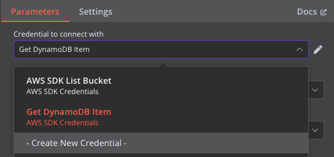
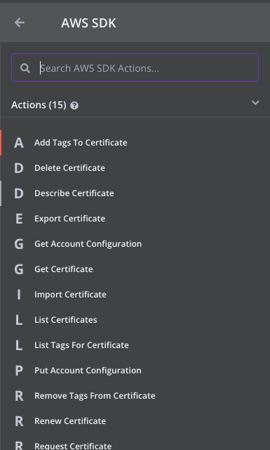
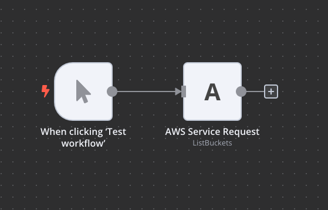
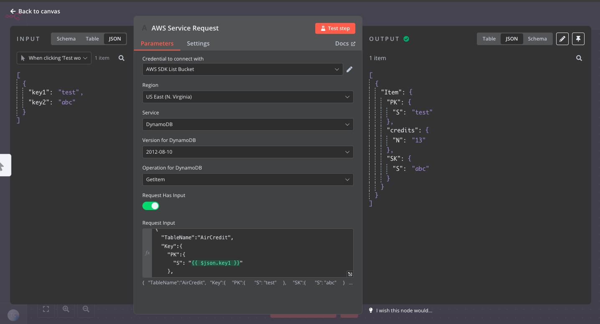
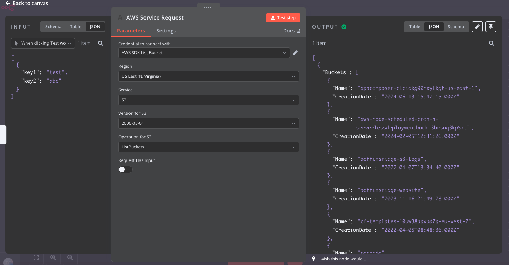
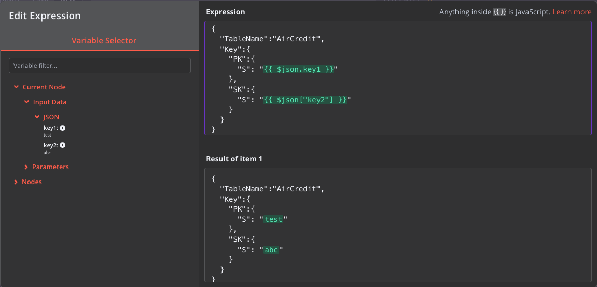
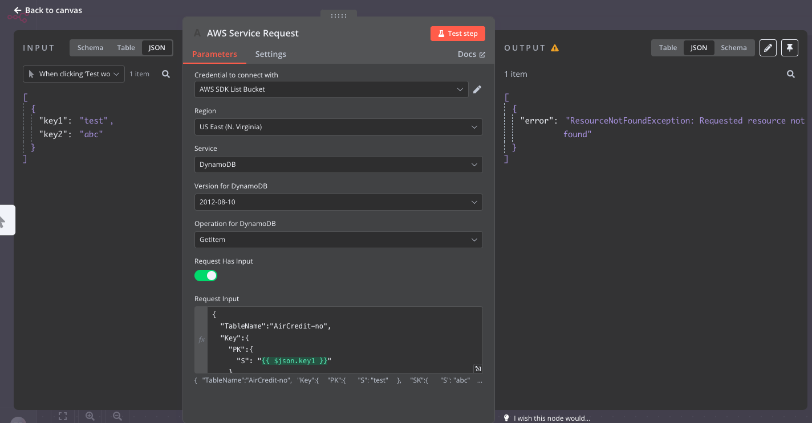

# n8n-nodes-aws-sdk-v3

This is an n8n community node. It lets you use any AWS service by wrapping the javascript AWS SDK V2 in your n8n workflows.

This AWS SDK Node isn't affiliated or endorsed by AWS. It starts with the latest V2 version of the JS SDK and iterates through the various services already built in and exported. These are assembled into a gigantic list which the Node makes available in the UI. This isn't as beautiful as the dedicated Service Nodes, however it at least makes calling any service possible. It's called V3 because I intended to use the V3 SDK however that doesn't have the ability to iterate on every service, so it's using V2 and the various V3 modules can be imported over time after the V2 sunset date.

[n8n](https://n8n.io/) is a [fair-code licensed](https://docs.n8n.io/reference/license/) workflow automation platform.

[Installation](#installation)  
[Operations](#operations)  
[Credentials](#credentials) <!-- delete if no auth needed -->  
[Compatibility](#compatibility)  
[Usage](#usage) <!-- delete if not using this section -->  
[Resources](#resources)  
[Version history](#version-history) <!-- delete if not using this section -->

## Installation

Follow the [installation guide](https://docs.n8n.io/integrations/community-nodes/installation/) in the n8n community nodes documentation.

Use the package at (here)[https://www.npmjs.com/package/n8n-nodes-aws-sdk-v3].

## Operations

- Every AWS Service
  - The latest supported Api Version
    - Every Operation for each Service

## Credentials

Add your User Access Key and store securely; either a single User for all your actions using this Node, or a single User / credential per Node.

## Compatibility

I'm not sure, only tested with `n8n v1.45.1`.

## Usage

It always presents these top 15 actions, click on any of them to bring in the Node and select a Service

Select your region, service, version, then operation. The list is ginormous (the json config is 83k lines) so it might be a bit slow on your browser.

The HasInput switch should be off when the Operation doesn't have arguments or it will error (e.g. `s3.listBuckets`).

The Input JSON is untyped so you need to ensure it's correct as per the [AWS SDK V2 documentation](https://docs.aws.amazon.com/AWSJavaScriptSDK/latest/AWS/S3.html) arguments for the SDK.

The Node passes AWS errors back up as Code or Message, so you can act on those. It'll either throw or catch, up to you. If it's an auth error check your Role Permissions. It'll also conveniently log any errors to console too.

## Resources

- [n8n community nodes documentation](https://docs.n8n.io/integrations/community-nodes/)

## Testing

`npm test` will validate the config is still correct for changing over V2 => V3 services.

## Version history

This is the first version, over time I might switch individual services to the AWS SDK V3 and add Input types for more popular services.
